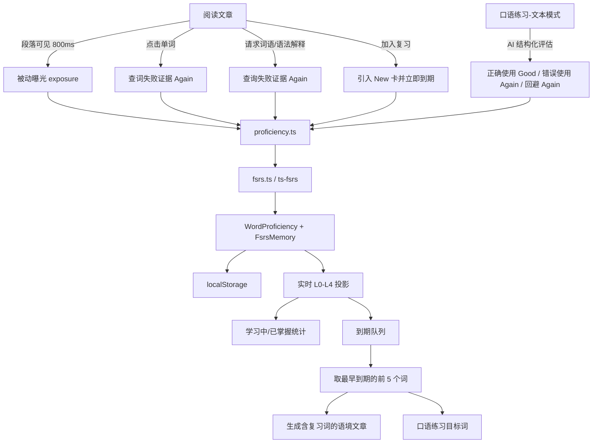

# 单词熟练度系统实现说明

> 基于仓库当前代码整理，日期：2026-07-24。本文描述的是**实际运行逻辑**，并区分已经接入 UI 的路径与仅保留在代码中的备用能力。

## 1. 一句话概括

项目采用一个三层混合模型来判断单词熟练度：

1. **FSRS-6** 管“现在还记得多少、何时该复习”，形成实时识别强度 `recognitionScore`；
2. **主动产出分** `productionScore` 管“能不能正确说出来/用出来”；
3. **被动曝光次数** `exposureCount` 管“在文章里见过多少次”，但曝光本身不伪装成回忆成功。

最终的 `L0–L4` 不是一个永久标签，而是根据当前时间、FSRS 可提取率和产出分实时投影出来的状态。即使曾经到达 L4，长期不复习后也可能自动降回 L3/L2。

---

## 2. 总体数据流



核心文件：

| 文件 | 作用 |
|---|---|
| `src/types.ts` | 熟练度、FSRS 卡片、复习日志、学习事件的数据结构 |
| `src/lib/proficiency.ts` | 单词归一化、动作到评分的映射、等级计算、到期队列、迁移 |
| `src/lib/fsrs.ts` | 对 `ts-fsrs` 的封装、参数、持久化、校验和旧数据升级 |
| `src/lib/readingExposure.ts` | 文章曝光的单词提取与可见度判定 |
| `src/lib/structuredProduction.ts` | 合并 AI 返回的正确/错误产出结果 |
| `src/App.tsx` | 连接 UI 事件、熟练度状态、统计、到期复习和持久化 |
| `src/components/ReadingScreen.tsx` | 阅读曝光、点击查词、加入复习、文章讨论 |
| `src/components/OralPracticeModal.tsx` | 口语文本评估与实时语音交互 |
| `server.ts` | 口语评估的结构化 JSON 输出 |

---

## 3. 核心数据结构

熟练度数据不是数组，而是按标准化词条索引的 Map：

```ts
Record<string, WordProficiency>
```

例如：

```ts
{
  "ephemeral": { ... },
  "break a leg": { ... }
}
```

`WordProficiency` 的主要字段：

| 字段 | 含义 | 是否为实时真值 |
|---|---|---|
| `lemma` | 归一化后的单词或短语 | 是 |
| `level` | L0–L4 的兼容缓存 | 否，展示前会重新计算 |
| `recognitionScore` | 识别/记忆强度，范围 0–1 | 持久化值只是缓存，实时值来自 FSRS |
| `productionScore` | 主动正确使用能力，范围 0–1 | 是 |
| `exposureCount` | 被动阅读曝光次数 | 是 |
| `stabilityDays` | FSRS 稳定度，单位为天 | 从 FSRS 卡片同步 |
| `lastReviewedAt` | 最近一次真实 FSRS 复习时间 | 从 FSRS 卡片同步 |
| `nextReviewDue` | 下次到期时间的兼容字段 | 实际判断读取 `fsrs.card.due` |
| 释义、音标、例句等 | 复习与展示所需元数据 | 是 |
| `fsrs` | 完整 FSRS 卡片和复习历史 | **核心真值** |

`FsrsMemory` 当前是 schema v2，保存：

- 算法版本：`FSRS-6`
- 实现版本：`ts-fsrs@5.4.1`
- 参数指纹 `parametersId`
- 完整卡片状态：`due`、`stability`、`difficulty`、`reps`、`lapses` 等
- 迁移边界 `historyStartReps`
- 迁移后的完整 `reviews[]`
- 是否已经进入复习系统 `isIntroduced`
- 最近一次评分 `lastRating`

---

## 4. “lemma”归一化是怎么做的

`toLemma()` 会：

1. 转为小写；
2. 把弯引号统一成普通 `'`；
3. 去除英文字母、撇号、空格、连字符之外的字符；
4. 把连字符和连续空白统一成一个空格；
5. 清理词首词尾撇号。

示例：

```text
can’t          -> can't
Break-a-Leg    -> break a leg
```

需要注意：它虽然叫 `toLemma`，但**没有做真正的词形还原**。例如 `run`、`running`、`ran` 会被当作不同词条。

短语匹配会检查词边界，并且不会跨句号、逗号、斜线、破折号等标点拼接短语，因此 `break a leg` 不会误匹配 `a break. A leg`。

---

## 5. FSRS-6 调度配置

项目通过 `ts-fsrs` 使用 FSRS-6，配置为：

```ts
{
  request_retention: 0.9,
  maximum_interval: 36500,
  enable_fuzz: false,
  enable_short_term: false,
  learning_steps: [],
  relearning_steps: [],
}
```

含义：

- 目标保留率为 90%；
- 最大间隔 36500 天；
- 不随机扰动到期日；
- 不使用分钟级的短期学习/重学步骤；
- 每次真实回忆事件由 FSRS 负责更新稳定度、难度、到期日和遗忘次数。

### 实时识别分

已有复习记录的词，其实时识别分是 FSRS 在时间 `t` 的可提取率：

```text
recognitionScore = R(t)
```

尚未发生第一次真实复习的 New 卡，识别分固定按 `0` 处理，避免旧缓存被误当作当前记忆证据。

---

## 6. L0–L4 等级如何计算

等级由 `getEffectiveProficiency()` 在指定时间重新计算，而不是直接相信 localStorage 中保存的 `level`。

| 等级 | 产品含义 | 当前代码的进入条件 |
|---|---|---|
| **L0** | 尚未进入学习/复习 | `reps === 0` 且 `isIntroduced === false` |
| **L1** | 生词、待首次复习或最近回忆失败 | 已引入但没有真实复习；或最近评分为 `Again`；或不满足更高等级 |
| **L2** | 学习中、已有初步记忆 | 已有复习，最近不是 `Again`，并且 `R(t) >= 0.14`，同时满足“曝光至少 3 次”或“最近有正向回忆” |
| **L3** | 巩固中 | `R(t) >= 0.6` 且 `productionScore >= 0.3` |
| **L4** | 掌握 | `R(t) >= 0.8` 且 `productionScore >= 0.7` |

判断顺序是 L4 → L3 → L2 → L1，因此高级条件优先。

### 一个重要特性

L4 不是永久勋章。随着时间流逝，`R(t)` 会下降：

```text
L4 --遗忘衰减--> L3/L2 --再次成功回忆--> L3/L4
```

`productionScore` 当前不会随时间自动衰减，但识别分会，所以长期不复习仍会降级。

---

## 7. 用户动作如何影响熟练度

| 用户动作 | FSRS 评分 | 产出分变化 | 结果 |
|---|---:|---:|---|
| 文章段落中的被动曝光 | 无评分 | 不变 | 只增加 `exposureCount` |
| 第 3 次被动曝光 | 无评分 | 不变 | 将 New 卡设为已引入并立即到期，但不增加 `reps` |
| 点击单词查词 | `Again` | 不变 | 视为无法直接回忆，进入/更新复习计划，保持 L1 |
| 请求该词/短语的语法或语义解释 | `Again` | 不变 | 同样视为回忆失败 |
| 手动加入复习 | 无评分 | 不变 | 保存音标/释义/例句，引入 New 卡并立即到期 |
| AI 判定正确主动使用 | `Good` | 当前 UI 路径 `+0.12` | 形成成功回忆证据，FSRS 安排下次复习 |
| AI 判定错误使用 | `Again` | `-0.25` | 强制回到 L1，按失败重新排期 |
| 明确要求使用目标词但用户回避 | `Again` | `-0.12` | 作为失败证据，但惩罚小于错误使用 |
| 手动标记掌握 | `Easy` | 至少提升到 `0.75` | 可直接达到 L4，但当前主 UI 没有接入此操作 |

### 10 秒去重

同一词、相同 FSRS Rating 在 10 秒内重复触发时只记一次，以避免：

- 双击；
- React/UI 重复提交；
- 网络请求重试；
- `reps`、`lapses` 和 `stability` 被污染。

不同 Rating 即使在 10 秒内出现也不会去重，因为它代表新的、相反的学习证据，例如先查词失败，随后正确用出。

---

## 8. 文章被动曝光如何记录

`ReadingScreen` 使用 `IntersectionObserver` 观察段落。

一段文字必须满足以下条件才算真正读过：

1. 浏览器标签页可见；
2. 段落达到足够可见高度；
3. 持续可见至少 **800ms**。

可见高度门槛为：

```text
min(段落高度 × 60%, 视口高度 × 60%)
```

这样很长的段落不需要把自身 60% 全部放入屏幕，只需要达到视口高度的 60%。

曝光去重有两层：

- 同一段落中的重复词只算一次；
- 一次文章页面生命周期内，同一词跨多个段落也只算一次。

离开文章再重新打开后，页面生命周期重置，同一词可以再次获得一次曝光。

当前曝光提取会记录段落里的**所有英文词形**，不只记录关键词或已加入复习的词。

### 第三次曝光的特殊处理

如果一个词从未被正式复习：

```text
第 1 次曝光 -> L0
第 2 次曝光 -> L0
第 3 次曝光 -> 引入复习系统，L1，due = 当前时间
```

第三次曝光不会伪造 `Good`/`Hard`，不会增加 `reps`，也不会生成复习日志。它只是说：“这个词见得够多了，现在值得进入待复习队列。”

---

## 9. 主动产出与 AI 评估链路

当前真正接入熟练度更新的主动产出入口，主要是**口语练习弹窗的文本模式**：

1. 前端发送 `intent: 'oral_feedback'`；
2. 服务端要求 AI 返回结构化结果：
   - `wordsUsedCorrectly[]`
   - `wordsUsedIncorrectly[]`
   - `errors[]`
   - `weakPoints[]`
   - `scoreOutOf10`
3. 客户端只接受已经存在于熟练度 Map 中的词；
4. 同一批结果里，“错误使用”优先于“正确使用”；
5. 正确词获得 `Good` 和 `productionScore + 0.12`；
6. 错误词获得 `Again` 和 `productionScore - 0.25`；
7. 到期队列前 5 个词会成为目标词。若用户说了至少 4 个词，却没有使用某个目标词，且 AI 也没有明确把它判成正确或错误，则该词可能被判定为“回避”，获得 `Again` 和 `-0.12`。

### 不会更新熟练度的对话

- **文章底部的苏格拉底式讨论**：服务端强制返回空的正确/错误词数组，客户端只记录讨论次数与事件，不更新单词熟练度。
- **实时语音模式**：当前只进行实时对话和转写，没有把转写结果再次送入 `oral_feedback` 结构化评估，因此不会更新熟练度。

---

## 10. 到期队列与语境复习

到期判断条件：

```text
实时 level >= 1
并且 fsrs.card.due <= 当前时间
```

到期词按 `due` 从早到晚排序。`App` 每 60 秒刷新一次复习时钟，因此统计和到期列表最多存在约 1 分钟的 UI 延迟。

当前使用方式：

- 首页显示待复习数量；
- P3 学习报告显示待复习数量；
- “Recommend for Me”和“针对性复习”取最早到期的前 5 个词；
- 服务端生成包含这些词的文章；
- 文章通过 `embeddedReviewWords` 高亮这些词；
- 口语练习也取前 5 个到期词作为产出目标。

### 当前闭环上的关键事实

**阅读一篇包含到期词的语境文章，本身不会把该词标记为成功复习。**

被动曝光不会产生 `Good`，文章讨论也不会更新熟练度。因此，语境文章目前主要负责“再次呈现”和“高亮”，真正清除失败状态/形成正向 FSRS 证据，仍依赖口语文本评估中的正确主动使用，或代码中尚未接入主 UI 的手动 `Easy` 操作。

---

## 11. 统计与展示

`countByBand()` 使用实时投影后的等级统计：

```text
学习中 = L1 + L2 + L3
已掌握 = L4
L0 不进入这两个数字
```

P3 展示：

- 已掌握词数；
- 学习中词数；
- 到期复习词数；
- 学习事件总数；
- 文章级查词次数与讨论次数；
- AI 返回的语法/表达薄弱点。

其中连续学习天数当前是固定演示值 `15`，并非由学习事件或熟练度数据计算。

### 学习事件日志

事件保存在 `events` 中，最多保留最近 200 条。当前类型包括：

- `click`
- `exposure`
- `grammar_query`
- `discussion`
- `review_start`
- `add_review`
- `incorrect_use`
- `avoidance`

目前没有单独记录“正确使用/Good”事件，所以事件日志不是一份完整的 FSRS 审计日志；完整评分历史在每个词的 `fsrs.reviews[]` 中。

---

## 12. 持久化、校验与迁移

熟练度保存在浏览器 localStorage：

```text
english-ai:v2:proficiency
```

加载流程：

```text
读取 JSON
  -> 校验根对象
  -> 校验每个 WordProficiency 字段
  -> 重新归一化 key/lemma
  -> 跳过损坏记录
  -> 校验或升级 FSRS memory
  -> 必要时从旧字段迁移
```

### 迁移原则

- 旧 L0 只代表被动曝光，迁移成未引入的 New 卡，不伪造复习；
- 旧 L1–L4 若没有完整日志，会保留原来的稳定度、到期时间等聚合证据；
- `historyStartReps` 表示“迁移前已有多少次无法逐条还原的历史复习”；
- 迁移完成后的每一次复习必须出现在 `reviews[]`；
- 校验要求：

```text
historyStartReps + reviews.length === card.reps
```

- 算法版本、实现版本或参数指纹不兼容时，不会盲目信任旧 FSRS 对象。

状态变化后会自动写回 localStorage。解析或写入失败不会让应用崩溃：读取失败回退默认值，写入失败输出控制台错误。

当前没有后端数据库、账号同步或跨设备同步。

---

## 13. 初始数据

首次打开且 localStorage 中没有熟练度数据时，会用 `INITIAL_REVIEW_WORDS` 初始化。

这些词会被创建为：

- L1；
- `isIntroduced = true`；
- `reps = 0`；
- 立即到期；
- `productionScore = 0.1`；
- 保留音标、词性、英汉释义与例句。

也就是说，初始词是“已经加入复习、等待第一次真实回忆评分”的 New 卡，而不是已经学习成功的词。

---

## 14. 当前实现的优点

1. **不把阅读曝光伪装成记住了**：曝光与回忆评分严格分离。
2. **识别和产出分开**：能看懂不等于能说出，L3/L4 必须满足产出阈值。
3. **熟练度随时间变化**：等级基于实时 FSRS 可提取率，而不是永久标签。
4. **完整保存 FSRS 状态**：卡片、评分日志、参数指纹和迁移边界都有记录。
5. **失败类型有区分**：错误使用的产出惩罚大于回避。
6. **防重复提交**：10 秒相同评分去重。
7. **坏数据可恢复**：localStorage 数据有验证、跳过和旧版本迁移。
8. **测试覆盖核心不变量**：曝光、等级阈值、遗忘衰减、到期、日志完整性、迁移、去重和短语边界均有自动化测试。

---

## 15. 当前限制与值得注意的风险

### 15.1 归一化不是真正的词形还原

`run`、`runs`、`running` 会形成不同记录，可能拆散同一词族的学习证据。

### 15.2 曝光会追踪所有英文词

目前没有停用词过滤、词频门槛或目标词筛选。多次重开文章后，`the`、`and` 等常见词以及不同词形都可能进入 Map，第三次曝光后甚至进入到期队列。

### 15.3 点击查词一律按 `Again`

用户可能只是出于好奇、确认发音或查看例句，但系统会直接把点击解释为回忆失败，可能造成过度惩罚。

### 15.4 语境复习缺少文章内的成功确认

到期词被嵌入新文章后，阅读和讨论都不会产生成功回忆评分。因此“生成语境文章”与“完成一次 FSRS 复习”目前并未完全闭环。

### 15.5 正向产出路径较窄

当前已接入的正向证据主要来自口语弹窗的文本评估。实时语音模式和文章讨论不会更新熟练度。

### 15.6 AI 失败的降级路径仍可能产生回避惩罚

口语评估请求失败时，fallback 的正确/错误数组为空，但客户端仍会根据文本和目标词计算“回避”。这意味着网络失败时，未使用的到期词仍可能被记为 `Again`。

### 15.7 手动掌握和词卡代码未接入主 UI

`applyMastered()`、`proficiencyToReviewWords()` 和 `TargetedReviewModal` 存在，但当前应用没有挂载这条路径；实际产品主路径是语境文章。

### 15.8 只使用 localStorage

完整复习历史会持续增长，受浏览器配额影响，也无法跨设备同步或由服务端审计。

### 15.9 事件日志不是完整评分日志

正确使用没有对应的 `LearningEvent`。如果要分析“用户为什么升级”，需要读取词条内部的 FSRS review history，而不能只看全局事件列表。

---

## 16. 自动化测试对应关系

| 测试文件 | 覆盖内容 |
|---|---|
| `tests/proficiency.test.ts` | L0–L4、曝光、动作评分、生产阈值、短语匹配、迁移、10 秒去重 |
| `tests/fsrs.test.ts` | FSRS 状态与日志、参数指纹、稳定度、遗忘、到期、历史完整性 |
| `tests/readingExposure.test.ts` | 单词提取、曝光去重、撇号、长段落可见度 |
| `tests/structuredProduction.test.ts` | 正确/错误结果归一化、去重、错误优先、只更新已追踪词 |
| `tests/storage.test.ts` | localStorage 读写、损坏数据回退、状态标准化 |

常用验证命令：

```bash
npm test
npm run lint
```

---

## 17. 最简心智模型

可以把每个词理解成三块状态：

```text
是否值得复习？  <- exposureCount / 用户主动加入
现在记得多少？  <- FSRS R(t)、stability、due、Again/Good/Easy
能否主动用对？  <- productionScore
```

然后统一投影：

```text
L0：只见过，还没进入复习
L1：已进入复习，或刚失败
L2：已有初步成功回忆
L3：记得较稳，并且有一定主动产出
L4：记得很稳，并且主动产出能力较高
```

---

## 18. 本次验证结果

验证日期：2026-07-24。

| 验证项 | 结果 |
|---|---|
| 熟练度相关定向测试 | 40 / 40 通过 |
| 项目全量自动化测试 | 76 / 76 通过 |
| TypeScript 静态检查（`npm run lint`） | 通过 |

执行的定向测试命令：

```bash
npx tsx --test tests/proficiency.test.ts tests/fsrs.test.ts tests/readingExposure.test.ts tests/structuredProduction.test.ts tests/storage.test.ts
```

全量测试与静态检查命令：

```bash
npm test
npm run lint
```

以上结果说明当前实现与本文描述的核心规则一致；它们证明现有测试覆盖下的行为正确，但不代表第 15 节列出的产品闭环与建模限制已经解决。
